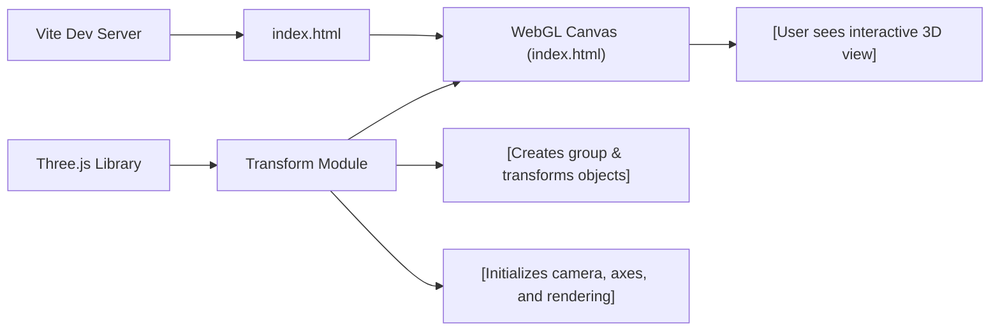

# Transform Module

## Overview
The Transform module is a core visual component for Three.js-based applications, providing an interactive 3D scene featuring grouped objects and basic geometric transformations. It demonstrates how to create, scale, rotate, and position objects in a 3D environment, and renders them on a WebGL canvas using Three.js. This module is foundational for scenes that require grouped manipulation of multiple mesh objects and showcases camera configuration, grouping, and basic axes visualization for educational or prototyping purposes.

## Key Features

- **3D Object Grouping and Transformation**: 
  Supports the creation of a group node containing multiple cube meshes. The group can be collectively scaled and rotated, enabling unified manipulation of related objects in the scene.
  
- **Mesh Placement and Rendering**:
  Instantiates multiple cube meshes, positions them independently along the X-axis, and adds them to the group. Efficiently renders the scene to a WebGL canvas.
  
- **Camera Configuration**:
  Utilizes a perspective camera to view the scene, allowing developers to explore different viewpoints and experiment with camera positioning.
  
- **Axes Visualization**:
  Incorporates an AxesHelper object, which overlays the standard X/Y/Z axes, helping users orient themselves within the 3D coordinate space.
  
- **Scene Initialization**:
  Provides automated scene setup, including renderer initialization, sizing, and immediate rendering for rapid visualization and prototyping.

## System Errors

- **Canvas Not Found**:
  - **Description**: If the HTML canvas element with class `.webgl` is missing, the renderer will fail to initialize and nothing will appear on the page.
  - **Resolution**: Ensure that `<canvas class="webgl"></canvas>` is present in the HTML file before loading the script.

- **Three.js Not Installed or Imported**:
  - **Description**: Missing Three.js dependency will cause import failure and module errors.
  - **Resolution**: Run `npm install` to ensure dependencies are present. Check your `package.json` for the Three.js library.

## Usage Examples

```js
// 1. Ensure your HTML contains the canvas:
// <canvas class="webgl"></canvas>

// 2. Import the Three.js library, then use Transform module logic:
import * as THREE from 'three'

// Create a scene and add a group with transformed cube meshes
const canvas = document.querySelector('canvas.webgl')
const scene = new THREE.Scene()

// Create and transform a group of objects
const group = new THREE.Group()
group.scale.y = 2
group.rotation.y = 0.2
scene.add(group)

// Add cubes at different positions within the group
for (let x of [-1.5, 0, 1.5]) {
    const cube = new THREE.Mesh(
        new THREE.BoxGeometry(1, 1, 1),
        new THREE.MeshBasicMaterial({ color: 0xff0000 })
    )
    cube.position.x = x
    group.add(cube)
}

// Add axes helper for orientation
scene.add(new THREE.AxesHelper())

// Set camera and renderer
const camera = new THREE.PerspectiveCamera(75, 800 / 600)
camera.position.z = 3
scene.add(camera)

const renderer = new THREE.WebGLRenderer({ canvas })
renderer.setSize(800, 600)
renderer.render(scene, camera)
```

## System Integration

