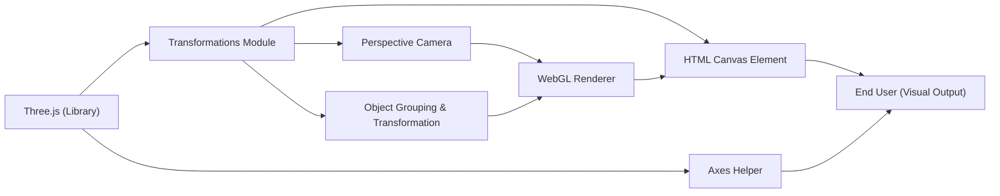

# Transformations Module

## Overview
The Transformations module demonstrates how to manipulate, arrange, and render 3D objects within a Three.js scene. It focuses on grouping, scaling, rotating, and positioning mesh objects, while also preparing the scene with cameras and helpers for clear visualization. This module is foundational for understanding and composing spatial relationships in 3D graphics workflows.

## Key Features
- **Object Grouping**: Allows multiple 3D meshes to be grouped as a single transformable object, enabling hierarchical transformations such as scaling and rotation to be applied to the entire group.
- **3D Object Transformations**: Supports scaling, rotating, and positioning objects individually or as part of a group to compose complex scenes.
- **Axes Helper Integration**: Adds visual guides (axes) to help users orient themselves within the scene, crucial for debugging and education.
- **Perspective Camera Setup**: Establishes a perspective camera to view the scene from a user-defined point in space.
- **Configurable Renderer**: Configures and initializes the WebGL renderer to display the scene within a designated canvas.

## System Errors
- **Canvas Element Not Found**: If the `<canvas class="webgl">` element does not exist in the HTML document, the renderer will fail to initialize and render the scene.
  - **Resolution**: Ensure that your HTML includes a `<canvas class="webgl"></canvas>` element before running the script.
- **WebGL Not Supported**: Some environments may not support WebGL, resulting in a failure to create or use a renderer.
  - **Resolution**: Test the application in a browser with WebGL support, and ensure drivers are up to date.

## Usage Examples

```javascript
// Basic setup for transformations in Three.js

import * as THREE from 'three'

// 1. Select the canvas element
const canvas = document.querySelector('canvas.webgl')

// 2. Create a scene
const scene = new THREE.Scene()

// 3. Create a group and apply transformations
const group = new THREE.Group()
group.scale.y = 2            // Scale group along Y-axis
group.rotation.y = 0.2       // Rotate group around Y-axis
scene.add(group)

// 4. Create and position cubes within the group
const cube1 = new THREE.Mesh(
    new THREE.BoxGeometry(1, 1, 1),
    new THREE.MeshBasicMaterial({ color: 0xff0000 })
)
cube1.position.x = -1.5

const cube2 = new THREE.Mesh(
    new THREE.BoxGeometry(1, 1, 1),
    new THREE.MeshBasicMaterial({ color: 0xff0000 })
)
cube2.position.x = 0

const cube3 = new THREE.Mesh(
    new THREE.BoxGeometry(1, 1, 1),
    new THREE.MeshBasicMaterial({ color: 0xff0000 })
)
cube3.position.x = 1.5

group.add(cube1, cube2, cube3)

// 5. Add axes helper for orientation reference
const axesHelper = new THREE.AxesHelper()
scene.add(axesHelper)

// 6. Configure camera and renderer
const sizes = { width: 800, height: 600 }
const camera = new THREE.PerspectiveCamera(75, sizes.width / sizes.height)
camera.position.z = 3
scene.add(camera)
const renderer = new THREE.WebGLRenderer({ canvas: canvas })
renderer.setSize(sizes.width, sizes.height)
renderer.render(scene, camera)
```

## System Integration


