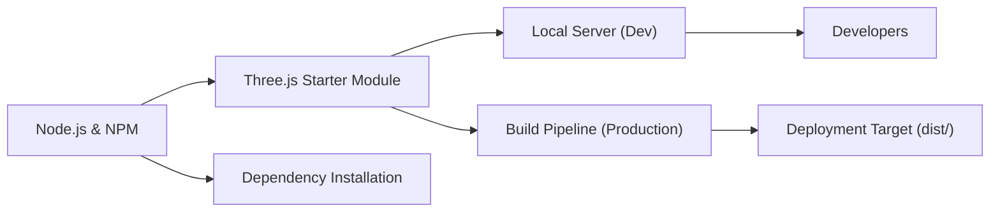

# Three.js Starter FAQ

## Overview
This module provides a starter setup for developing 3D web applications using Three.js. It streamlines environment configuration, dependency management, and standard development workflows, making it easier for developers to quickly build, run, and deploy Three.js projects.

## Key Features
- **Automated Dependency Installation**: Installs all required packages for a Three.js project with a single command.
- **Local Development Server**: Launches a local server at `localhost:8080` for live preview and iterative development.
- **Production Build Pipeline**: Generates optimized static assets in the `dist/` directory, making it easy to deploy the finished application.

## System Errors
- **Dependency Installation Failure**: Occurs if `npm install` cannot fetch or install all dependencies.  
  *Resolution*: Ensure internet connection, correct Node.js version, and try running `npm install` again. Check for error messages indicating specific missing packages.
- **Port Already in Use**: Happens if another process is using port 8080 when starting the development server.  
  *Resolution*: Stop the conflicting process or edit the server's port configuration.
- **Build Failures**: Build process stops due to missing files or syntax errors.  
  *Resolution*: Review the console error output, fix code issues, and rerun `npm run build`.

## Usage Examples

```bash
# 1. Install all dependencies (first-time setup)
npm install

# 2. Start the development server at localhost:8080
npm run dev

# 3. Build the app for production (output in 'dist/')
npm run build
```

## System Integration

