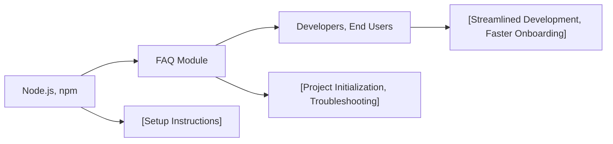

# FAQ Module

## Overview
The FAQ module provides essential information to help users quickly resolve common issues or questions related to setting up and using the Three.js starter project. Its primary purpose is to facilitate onboarding, clarify setup steps, and ensure smooth project initialization by assisting users with typical obstacles.

## Key Features
- **Project Setup Guidance**: Outlines necessary steps for installing dependencies, running the development server, and building the production bundle.
- **Troubleshooting Assistance**: Offers clear solutions for common errors encountered during installation and usage.
- **Quick Command Reference**: Provides easily accessible commands to streamline frequent project workflows.

## System Errors
- **Dependency Installation Failure**: Occurs if required packages are not installed.
  - **Resolution**: Ensure you have run `npm install` in your project directory before running or building the project.
- **Server Port Occupied**: The development server cannot start if port 8080 is in use.
  - **Resolution**: Close any application using port 8080, or configure a different port in your project settings.
- **Node.js Version Incompatibility**: Running outdated or unsupported versions of Node.js can cause errors.
  - **Resolution**: Download and install the latest LTS version of Node.js from [nodejs.org](https://nodejs.org/en/download/).

## Usage Examples
Practical code examples showing how to use the module:

```bash
# Install dependencies (only needed once)
npm install

# Start the local development server on localhost:8080
npm run dev

# Build the project for production (output in the dist/ directory)
npm run build
```

## System Integration

