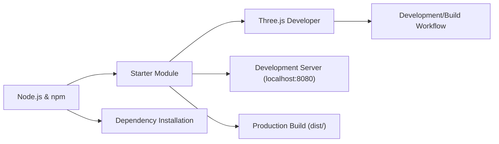

# Starter FAQ

## Overview
The **Starter** module provides a streamlined setup and development workflow for Three.js-based projects. It helps developers quickly install dependencies, start a local development server, and build ready-to-deploy production bundles. This module ensures consistency and reduces setup friction for teams working with Three.js.

## Key Features
- **Dependency Installation**: Automatically installs all necessary Node.js packages for the project environment.
- **Local Development Server**: Easily launches a development server on `localhost:8080` for live testing and preview.
- **Production Build**: Offers a one-command solution to build the project for production, outputting files to the `dist/` directory.
- **Cross-Platform Workflow**: Designed to be compatible with major operating systems supporting Node.js.

## System Errors
- **Dependency Installation Error**: Occurs when running `npm install` if dependencies are missing or there are network issues.
  - **Resolution**: Ensure a stable internet connection and that Node.js/npm are installed and up to date. Re-run `npm install`.
- **Server Startup Error**: When running `npm run dev`, the server may fail to start if the port is in use or dependencies are missing.
  - **Resolution**: Check if another service is using port 8080 and stop it, or change the port. Ensure dependencies are installed.
- **Build Error**: Errors during `npm run build` can be caused by misconfigured project files or incompatible modules.
  - **Resolution**: Review console error messages, check configuration files (`package.json`, etc.), and resolve any code issues.

## Usage Examples

```bash
# 1. Install all project dependencies (run once):
npm install

# 2. Start the development server at http://localhost:8080/
npm run dev

# 3. Build the project for production (output in 'dist/' folder):
npm run build
```

## System Integration

