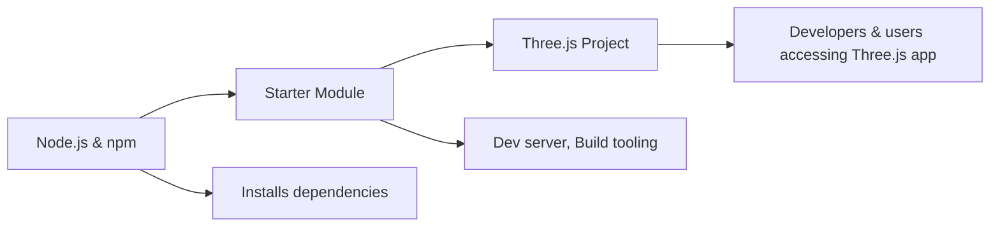

# Starter FAQ

## Overview
The **Starter** module serves as the foundational toolkit for initializing, running, and building a Three.js project. It streamlines the setup process, allowing developers to quickly get started with a local development environment, manage dependencies, and prepare production-ready builds. This module acts as the entry point for anyone beginning a Three.js journey in this repository.

## Key Features
- **Dependency Management**: Installs all required libraries and modules for the project with a single command.
- **Development Server**: Launches a local server (default: `localhost:8080`) for real-time project development and testing.
- **Production Build Tooling**: Compiles and bundles source files into optimized assets within the `dist/` directory for deployment.

## System Errors
- **Missing Node.js**:  
  *Description*: The environment lacks Node.js, preventing any npm commands from running.  
  *Resolution*: Download and install the latest version of Node.js from [nodejs.org](https://nodejs.org/en/download/).

- **Dependency Installation Failure**:  
  *Description*: Errors occur during `npm install`, often due to missing internet connection or permission issues.  
  *Resolution*: Check your network connection, ensure correct permissions, and, if relevant, try running with `sudo` on Unix-based systems.

- **Port Conflict (8080 in use)**:  
  *Description*: The development server fails to start because port 8080 is already occupied.  
  *Resolution*: Close the application using that port or modify the configuration to use a different port.

## Usage Examples

```bash
# Step 1: Install all project dependencies (only needed once)
npm install

# Step 2: Start the local development server
npm run dev

# Step 3: Build the project for production deployment
npm run build
```

## System Integration

