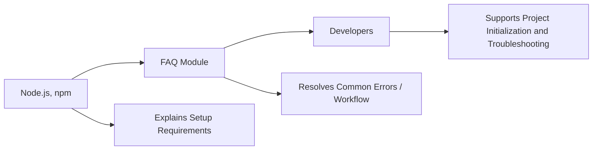

# FAQ

## Overview
This module provides answers to the most common questions encountered when setting up and using the Three.js Journey starter project. It helps developers quickly resolve setup, build, and runtime issues related to the development workflow.

## Key Features
- **Environment Setup Guidance**: Clarifies requirements like Node.js installation and initial project setup.
- **Development Workflow Assistance**: Explains how to run the local development server and build the project for production.
- **Troubleshooting Support**: Offers solutions to frequent errors and common pitfalls during installation, development, and build processes.

## System Errors
- **Missing Dependencies**:  
  *Description*: Error when running scripts due to uninstalled npm packages (e.g., "module not found").  
  *Resolution*: Run `npm install` in the project directory to fetch and install all required dependencies.

- **Build or Dev Server Fails to Start**:  
  *Description*: Errors like "command not found" or port 8080 in use prevent the app from running.  
  *Resolution*: Ensure Node.js is installed and the correct directory is used. If port 8080 is busy, stop other processes or change the port configuration.

- **Production Build Issues**:  
  *Description*: Errors or missing files in the `dist/` directory after running `npm run build`.  
  *Resolution*: Check for prior build errors in the terminal and resolve dependency/version conflicts; delete `dist/` and retry building.

## Usage Examples

```bash
# First-time setup: install dependencies
npm install

# Start local development server (opens app at http://localhost:8080)
npm run dev

# Create a production build in the dist/ directory
npm run build
```

## System Integration

