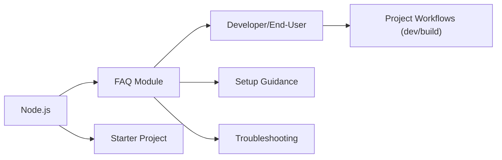

# FAQ Module

## Overview
The FAQ Module provides concise answers to common questions about setting up, running, and building the Three.js Journey project. It helps users get started, resolve typical onboarding issues, and understand key project workflows.

## Key Features
- **Setup Guidance**: Instructs users on installing dependencies and required software.
- **Development Server Instructions**: Explains how to launch and access the local development environment.
- **Production Build Workflow**: Details the process to generate a production-ready build.
- **Troubleshooting Support**: Offers resolutions for common errors during setup and usage.

## System Errors
- **Missing Node.js**: The project requires Node.js to run.  
  *Resolution*: Download and install Node.js from [nodejs.org](https://nodejs.org/en/download/).
- **Dependency Installation Errors**: Errors during `npm install` often indicate missing or incompatible packages.  
  *Resolution*: Ensure you have a recent version of Node.js and npm. Delete `node_modules` and `package-lock.json` and run `npm install` again.
- **Port Already in Use**: Running `npm run dev` may fail if port 8080 is occupied.  
  *Resolution*: Close conflicting applications or modify the server port.

## Usage Examples

```bash
# 1. Download and install Node.js from the official website:
#    https://nodejs.org/en/download/

# 2. Install project dependencies (only needed once):
npm install

# 3. Start the development server:
npm run dev
# Access the project at http://localhost:8080

# 4. Build the project for production:
npm run build
# Output files will be in the 'dist/' directory
```

## System Integration


