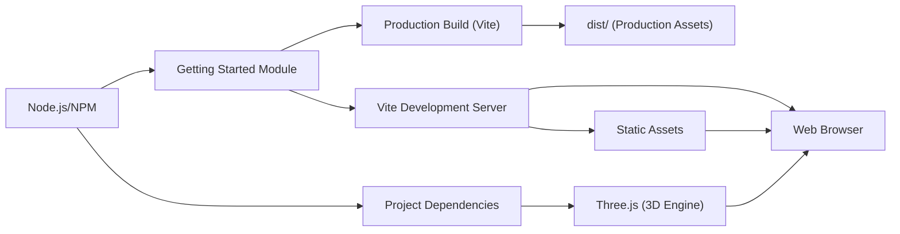

# Getting Started

## Overview
The Getting Started module provides an entry point for setting up, developing, and building the Three.js Journey Starter environment. It prepares the project workspace with all necessary dependencies, serves content locally, and builds production-ready assets. This module is essential for initializing new workspace instances and facilitating a streamlined development experience.

## Key Features

- **Dependency Management**: Automates the installation of Node.js dependencies using npm to ensure all required packages are available.
- **Development Server Initialization**: Launches a local server (powered by Vite) that serves the project at `localhost:8080`, enabling live development and preview in the browser.
- **Production Build Output**: Compiles and optimizes source files, placing the final assets in the `dist/` directory for deployment.
- **Static Assets Handling**: Serves and includes static assets from the dedicated `static/` folder, keeping public resources organized.
- **Network Accessibility**: Configures the development server to be accessible from the local network, supporting collaborative development and device testing.
- **Environment-specific Behavior**: Adapts server behavior for online sandboxes (like CodeSandbox) by disabling automatic browser opening in those contexts.

## System Errors

- **Missing Dependencies**: If `npm install` has not been run, development or build scripts may fail with `Cannot find module` errors.  
  **Resolution**: Run `npm install` in the project root before starting development.
- **Port Conflict**: If port 8080 is already in use, the development server may fail to start.  
  **Resolution**: Close the application using the port or modify the port in `vite.config.js`.
- **Node.js Not Installed**: If Node.js is missing, npm commands will fail.  
  **Resolution**: [Install Node.js](https://nodejs.org/en/download/) before proceeding.
- **Permission Issues**: Build or install commands may fail due to insufficient permissions (e.g., `EACCES`).  
  **Resolution**: Ensure you have appropriate permissions, or run commands as an administrator.

## Usage Examples

```bash
# 1. Install all project dependencies (run first time)
npm install

# 2. Start the development server and open the app at localhost:8080
npm run dev

# 3. Build the project for production (output goes to 'dist/' directory)
npm run build
```

## System Integration


