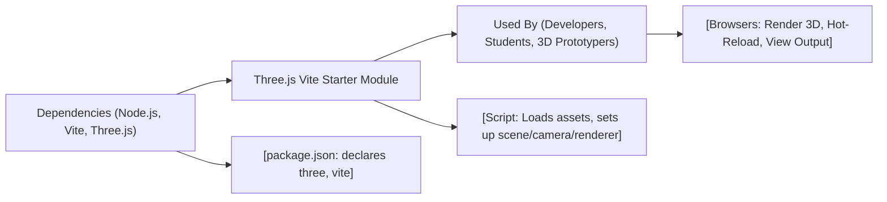

# Getting Started with the Three.js Vite Starter

## Overview
The Three.js Vite Starter module provides a ready-to-use starter template for developing Three.js projects with the fast build and development workflow of Vite. It coordinates asset loading, development server configuration, and integration of Three.js, giving users a simple environment for rapid prototyping and learning Three.js.

## Key Features
- **Pre-configured Development Server**: Utilizes Vite to provide a blazing-fast local development server with hot-reload for iterative Three.js development.
- **Production-ready Builds**: Seamless bundling and optimization for production, outputting minified assets in a `dist/` folder.
- **Three.js Integration**: All essential Three.js dependencies and sample setup included out-of-the-box for immediate 3D rendering.
- **Simple Project Structure**: Organizes your assets, scripts, and styles for easy extension and understanding.
- **Customizable Build Configuration**: Easily adjust root paths, public directories, and build outputs in `vite.config.js`.

## System Errors
It's important to document common errors and troubleshooting specify :
- **Port In Use**: If `localhost:8080` is not accessible, the server may be running on a different port or another process is using it. Check your console output for the actual port and ensure no conflict.
- **Dependency Not Found**: Errors like `Cannot find module 'three'` indicate missing dependencies. Run `npm install` to resolve.
- **White Screen/No Canvas**: If the 3D scene does not appear, ensure your browser supports WebGL and that `npm run dev` has been executed in the project directory.

## Usage Examples
Practical code examples showing how to use the module:

```bash
# Install all dependencies (only the first time)
npm install

# Start the fast local development server
npm run dev

# Open your browser at the shown localhost URL (e.g., http://localhost:8080)
# You will see a red 3D cube rendered using Three.js

# Make changes in src/script.js or src/style.css,
# and the browser automatically updates via Vite's hot reload
```

Basic usage in `src/script.js`:

```js
import * as THREE from 'three'
const canvas = document.querySelector('canvas.webgl')
const scene = new THREE.Scene()
const geometry = new THREE.BoxGeometry(1, 1, 1)
const material = new THREE.MeshBasicMaterial({ color: 0xff0000 })
const mesh = new THREE.Mesh(geometry, material)
scene.add(mesh)
const camera = new THREE.PerspectiveCamera(75, 800 / 600)
camera.position.z = 3
scene.add(camera)
const renderer = new THREE.WebGLRenderer({ canvas })
renderer.setSize(800, 600)
renderer.render(scene, camera)
```

## System Integration

