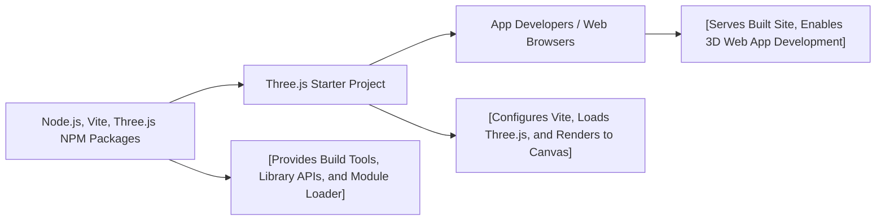

# Getting Started with the Three.js Starter Project

## Overview
This starter module provides a ready-to-use environment for Three.js development using Vite as the build tool. It enables rapid setup and launching of 3D graphics applications that render directly into an HTML canvas. The project is structured for ease-of-use, supporting both development and production builds, and uses modern frontend tooling and workflows.

## Key Features
- **Vite Development Server**: Instantly runs a fast local server at `localhost:8080` for iterative development, complete with live reload and network access.
- **Three.js Integration**: Includes the full Three.js library for building advanced WebGL scenes and 3D content.
- **Production Build Pipeline**: One-command build outputs fully bundled and optimized assets to the `/dist` directory, ready for deployment.
- **Project Structure & Index Template**: Organized folder structure (`src/`, `static/`, `dist/`) and pre-wired HTML (`index.html`) with Three.js canvas and script loading.

## System Errors
- **Port Conflict Error**: If port 8080 is already in use, starting the dev server will fail (e.g., "EADDRINUSE").  
  *Resolution*: Stop the conflicting process or change the port in `vite.config.js`.
- **Dependency Missing Error**: If dependencies are not installed, commands will fail with errors about missing packages.  
  *Resolution*: Run `npm install` before starting the server or building.
- **Build Output Error**: If the `dist/` directory isn't created as expected (permissions or misconfiguration).  
  *Resolution*: Ensure you have write permissions to the parent directory and the build configuration remains unaltered.

## Usage Examples

```bash
# Step 1: Install project dependencies (run once)
npm install

# Step 2: Start local development server (live reload at http://localhost:8080)
npm run dev

# Step 3: Build production assets into the 'dist/' directory
npm run build
```

```html
<!-- Example: Rendering Three.js in your app (src/index.html) -->
<canvas class="webgl"></canvas>
<script type="module" src="./script.js"></script>
```

## System Integration


