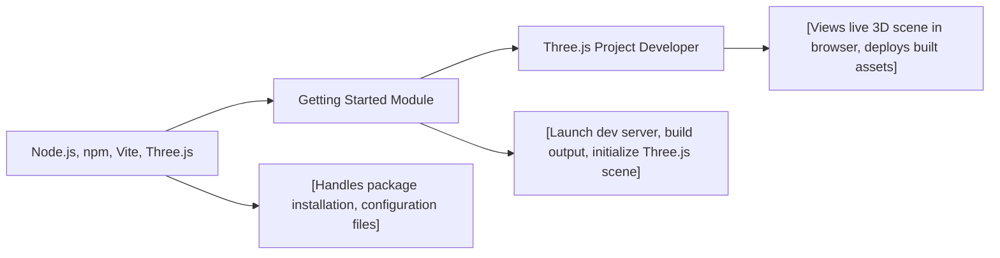

# Getting Started Module

## Overview
The Getting Started module provides a ready-to-use development environment for prototyping and launching Three.js web projects. It integrates Vite as a local server and build tool, configures project structure, and establishes a boilerplate Three.js scene. This module enables developers to quickly start visualizing 3D graphics in the browser with minimal setup.

## Key Features
- **Local Development Server**: Launches a Vite-powered development server for instant preview and hot-reloading at `localhost:8080`.
- **Production Build System**: Uses Vite to bundle and optimize project files into the `dist/` directory for deployment.
- **Three.js Scene Boilerplate**: Instantiates a cube scene in Three.js rendered onto a responsive HTML canvas.
- **Simple Project Structure**: Organized with clear separation between configuration, assets, scripts, and output directories.
- **Automated Dependency Management**: Handles npm-based installation and updates for critical libraries like `three` and `vite`.

## System Errors
- **Port Already In Use**: If `localhost:8080` is occupied, the dev server may fail to start.  
  **Resolution**: Stop the conflicting service or change the port in `vite.config.js`.
- **Missing Dependencies**: Running `npm run dev` without `npm install` may result in `module not found` errors.  
  **Resolution**: Always run `npm install` before starting or building the project.
- **Canvas Not Displayed**: If the `<canvas class="webgl">` selector is missing or misnamed, rendering will not occur.  
  **Resolution**: Ensure the HTML contains `<canvas class="webgl"></canvas>`.

## Usage Examples

```bash
# 1. Install project dependencies (run once)
npm install

# 2. Start the development server (for local previews)
npm run dev

# 3. Build the project for production (output in /dist)
npm run build
```

```javascript
// Main entry point (src/script.js)
import * as THREE from 'three';

const canvas = document.querySelector('canvas.webgl');
const scene = new THREE.Scene();

// Basic cube mesh
const geometry = new THREE.BoxGeometry(1, 1, 1);
const material = new THREE.MeshBasicMaterial({ color: 0xff0000 });
const mesh = new THREE.Mesh(geometry, material);
scene.add(mesh);

// Camera setup
const camera = new THREE.PerspectiveCamera(75, 800 / 600);
camera.position.z = 3;
scene.add(camera);

// Renderer initialization
const renderer = new THREE.WebGLRenderer({ canvas });
renderer.setSize(800, 600);
renderer.render(scene, camera);
```

## System Integration


