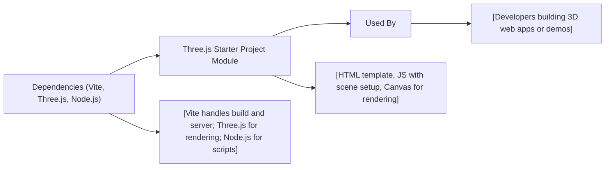

# Three.js Starter Project

## Overview
The Three.js Starter Project module provides a ready-to-use development environment for rapidly building and previewing interactive 3D experiences using Three.js. It establishes a minimal, modern workflow with Vite, delivering the essentials for fast prototyping and learning with WebGL-powered 3D graphics in the browser. This module manages both development and production setups, enabling efficient integration and iteration for Three.js-based applications.

## Key Features
- **Interactive 3D Canvas Integration**: Bootstraps a browser-based Three.js scene and renders a 3D object (cube) to a `<canvas>` element, demonstrating a complete graphics pipeline from scene setup to rendering.
- **Modern Development Workflow**: Utilizes Vite for fast local development with hot module replacement, and streamlined production builds.
- **Template HTML & Asset Handling**: Includes template HTML with styled canvas setup for 3D rendering and modular asset management.
- **Configurable Build Pipeline**: Out-of-the-box configuration for local server hosting (network accessible), automatic browser launch (outside sandboxes), sourcemaps, and clean production output.

## System Errors
- **Port Already in Use**: If the default development server port (8080) is occupied, Vite will prompt an error.  
  _Resolution_: Stop the conflicting process or change the port in `vite.config.js`.
- **Missing Three.js Dependency**: Error when Three.js is not installed or not found.  
  _Resolution_: Run `npm install` to ensure all dependencies are properly installed.
- **Canvas Not Found**: If the canvas element selector fails (e.g., class name changed), no rendering will occur.  
  _Resolution_: Ensure `<canvas class="webgl"></canvas>` exists in `index.html` and matches the query in `script.js`.
- **Build Directory Permission Issues**: Errors writing to `dist/` if lacking permissions.  
  _Resolution_: Check filesystem permissions, and ensure your user can write to the project directory.

## Usage Examples
```bash
# Install project dependencies (first time only)
npm install

# Start the local development server (opens browser by default)
npm run dev

# Build the project for production (outputs to `dist/` directory)
npm run build
```

```js
// Example: Editing src/script.js to add a spinning animation
import * as THREE from 'three'

const canvas = document.querySelector('canvas.webgl')
const scene = new THREE.Scene()
const geometry = new THREE.BoxGeometry(1, 1, 1)
const material = new THREE.MeshBasicMaterial({ color: 0xff0000 })
const mesh = new THREE.Mesh(geometry, material)
scene.add(mesh)
const sizes = { width: 800, height: 600 }
const camera = new THREE.PerspectiveCamera(75, sizes.width / sizes.height)
camera.position.z = 3
scene.add(camera)

const renderer = new THREE.WebGLRenderer({ canvas: canvas })
renderer.setSize(sizes.width, sizes.height)

// Simple animation loop
function animate() {
    mesh.rotation.y += 0.01
    renderer.render(scene, camera)
    requestAnimationFrame(animate)
}
animate()
```

## System Integration

